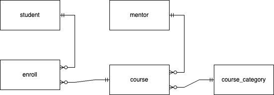

# Project Brief Template Data Engineering

## 💻 Technical Brief

## Contraints

- Data terpisah berasal dari multiple source seperti db, excel, dan data source yg lain.
- Constraint setiap problem akan spesifik ditentukan pada bagian project description.

### Requirements

- Melakukan pengambilan data, include orchestration, transformation. i.e., ETL) (Mandatory)
- Melakukan pengambilan data agregasi dari db + excel (Mandatory)
- Melakukan penerapan replication & sharding (Poin plus)
- Mengambil data secara real time (Poin plus)
- Membuat visualisasi (Poin plus)

### Project Description and Expected Delivereble

#### Background

Sebuah edu-tech "pinter-skuy" menyediakan online course yg diisi oleh mentor profesional dan siapapun bisa mengambil course tsb. Setelah bisnis mulai berjalan, management level ingin melakukan monitoring & evaluasi dari online course mereka.

Oleh karena itu, sumber informasi yg selama ini tersimpan di source yg berbeda-beda, ingin dijadikan satu sebagai ***single source of truth***, untuk kemudian dilakukan analisis.

#### Expected Deliverable

1. Buat ELT/ETL pipeline yg memproses [data disini](https://github.com/firdausraginda/capstone-alta-de-project/tree/main/data-source). Data source terdiri dari:
    * 2 CSV file
    * 2 JSON file
    * table `course_enrollment` di postgreSQL DB
2. Buat table di bigquery, dgn datasetnya masing2, sebagai berikut:
    * dimensional table
        * dwh.dim_student
        * dwh.dim_mentor
        * dwh.dim_category
    * fact table
        * dwh.fact_course
        * dwh.fact_course_enrollment
    * datamart table
        * datamart.course_enrollment_summary
3. Semua BQ table memiliki setup seperti berikut:
    * write diposition = write_truncate
    * create disposition = create_if_needed
4. Buat visualisasi dari data di datamart table, yg mampu menjawab pertanyaan berikut:
    * berapa jumlah student yg ambil minimal 1 course per `city` student
    * berapa jumlah student yg mengambil course per `course category type`
    * top 3 mentor yg course nya paling banyak di ambil
5. Orchestrate ELT/ETL pipeline yg sudah dibuat menggunakan airflow, dgn job yg jalan `daily`

Note: Jangan push service account teman2 ke github repo, buat `.gitignore` nya

#### Success Criteria

Kriteria sukses/tidak project ini adalah, ketika hasil akhir memiliki: 
* Berhasil ingest data dari beberapa source ke bigquery
* Table yg dibuat di bigquery, sesuai dgn requirement & kebutuhan visualisasi
* Orchestrate ELT/ETL pipeline dgn airflow
* Berhasil membuat visualisasi yg mampu menjawab pertanyaan di atas
* Membuat step by step penjelasan tentang bagaimana cara me-replikasi project tersebut

Nice to have:
* Deploy airflow ke Google Cloud Composer atau Google Compute Engine

#### Documentation

- [data modelling](https://ossinsight.io/blog/trends-and-insights-from-github-2022/)
- [connect to postgreSQL DB dgn database.ini](https://www.postgresqltutorial.com/postgresql-python/connect/)
- [running airflow using docker](https://airflow.apache.org/docs/apache-airflow/stable/howto/docker-compose/index.html)
- [implementation airflow using docker](https://github.com/firdausraginda/basic-airflow/tree/master)

#### Assest

- silahkan download `data-source` yg ada di repo ini

## 📆 Schedule Meeting and Format Mentoring

### Schedule Mentoring

- Mentoring dilakukan 3x dalam sepekan dengan alokasi 60 menit mentoring tiap sesi.
- Jadwal Mentoring dapat menyesuaikan jadwal mentor dan disepakati bersama dengan team, jika ada perubahan mentor dan tim terkait bisa langsung mengkomunikasikan.
- Mentoring bisa dilakukan hari senin-jumat atau sabtu-minggu sesuai availability mentor dan team.

### Mentoring Alocation

| Mentoring | Allocation Time | Agenda                                                      |
| --------- | --------------- | ----------------------------------------------------------- |
| Part 1    | 15 minutes      | Update Team in General                                      |
|           |                 | Update Every Member of The Team                             |
|           |                 | Showing Progress Based On Project Management Tools (Trello) |
| Part 2    | 45 minutes      | Discussion topics according to the problem at hand          |

## ⚠️ General Rules

### Hal-hal yang harus dilakukan oleh Mentees dan Team

- Setiap individu wajib berkontribusi & aktif berkomunikasi dalam team (yang tidak berkontribusi maka tidak mendapatkan nilai, nilai diberikan kenapa yang berkontribusi aktif).
- Setiap team wajib memiliki group komunikasi (membuat group telegram).
- Setiap team wajib menggunakan trello untuk management task & membagi task dg proporsional setiap member.
- Setiap team wajib mengadakan daily meeting setiap hari untuk berkoordinasi.

### Tindakan yang dianggap sebagai pelanggaran bagi Mentees dan Team

- Individu yang tidak aktif atau slow response dalam berkomunikasi dg tim (tidak membalas komunikasi team lebih dari 2 jam saat jam aktif: 9 am - 9 pm).
- Individu tidak ikut berkontribusi dalam mengerjakan task.
- Tim yang tidak membuat group komunikasi.
- Tim tidak menggunakan trello.
- Tim tidak melakukan pembagian tugas.
- Tim yang tidak mengadakan daily meeting.
